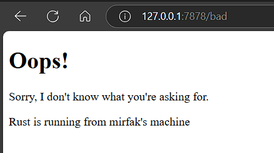

<details>
<summary>Commit 1 Reflection notes</summary>

1. Handling TCP Streams with BufReader
TcpStream wrapped inside a BufReader to simplify reading the incoming stream line by line. This makes it easier to parse the HTTP request headers since HTTP headers are line-separated text.

2. Collecting the HTTP Request
`.lines()` returns an iterator of each line from the stream.
- The `map(|result| result.unwrap())` part forcefully unwraps each `Result<String, Error>`, assuming the read will succeed.
- The `take_while(|line| !line.is_empty())` stops reading once an empty line is encountered, which corresponds to the end of HTTP headers in a typical request.

3. Printing the HTTP Request
By collecting the lines into a `Vec<String>`, full HTTP request headers are printed out with `println!()`.
</details>

<details>
<summary>Commit 2 Reflection notes</summary>

1. Serving a Static HTML File
By adding `fs::read_to_string("hello.html")`, the program now can serve a static html file.

2. Raw HTTP Response
``` Rust
let status_line = "HTTP/1.1 200 OK";
let response = format!("{status_line}\r\nContent-Length: {length}\r\n\r\n{contents}");
```
This reinforced how HTTP responses are structured, starting with the status line, followed by the headers, and then the body separated by `\r\n\r\n`.

Screen capture:

</details>
<details>
<summary>Commit 3 Reflection notes</summary>

1. Why Refactoring Was Needed
Initially, every response (either for 200 or 404) got the same page. Therefore, we need to refactor the code to accomodate new logics.
Refactoring the code helps by making the code easier and making future changes simpler.

2. How was the logic split
We introduced a new pattern:
```Rust
let (status_line, contents) = if request_line.contains("GET / ") {
        ("HTTP/1.1 200 OK", fs::read_to_string("hello.html").unwrap())
    } else {
        ("HTTP/1.1 404 NOT FOUND", fs::read_to_string("404.html").unwrap())
    };
```
This logic routes response to their own page.

Screen capture:

</details>

<details>
<summary>Commit 4 Reflection notes</summary>

Current program is single-threaded. When we open the first tab (`/sleep`), the second tab needs to wait for the first tab to be opened, this behaviour is called `blocking`. The TCP listener accepts incoming streams one by one. Every time a new connection arrives, `handle_connection()` is executed immediately inside the main thread. Since `/sleep` route has a `thread::sleep(10)`, this causes the thread to halt for 10 seconds.
While the thread is sleeping, the listener is busy and cannot accept or process the next connection until it wakes up.

</details>

<details>
<summary>Commit 5 Reflection notes</summary>

This refactoring is important as it prevents long-running requests like /sleep from blocking the entire server, improving scalability and responsiveness. The addition of error handling and safe concurrency using Rust’s ownership and locking mechanisms gave me insights into building efficient, real-world server architectures.

</details>